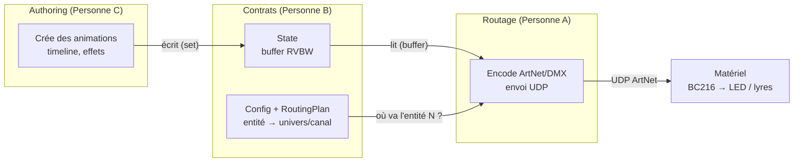
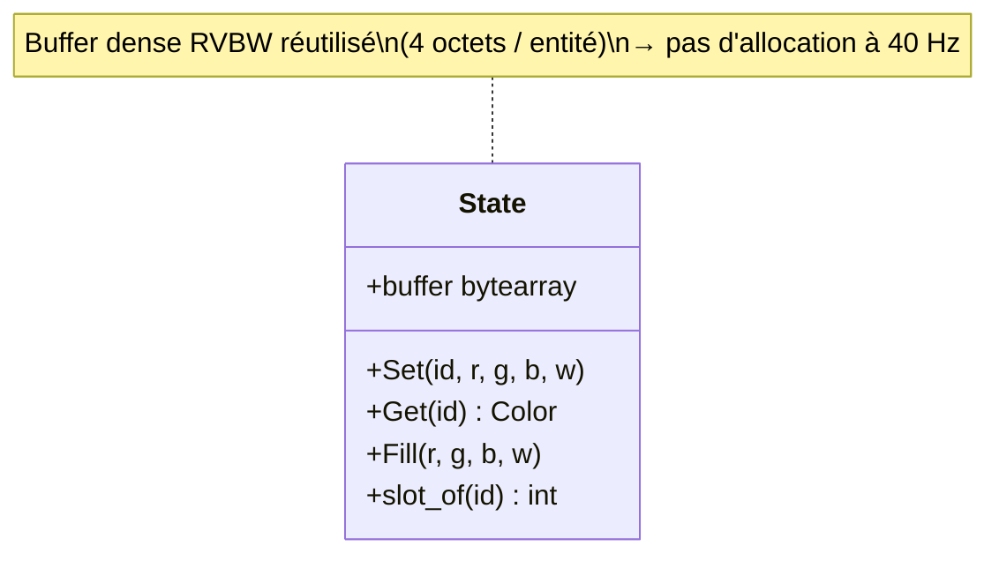
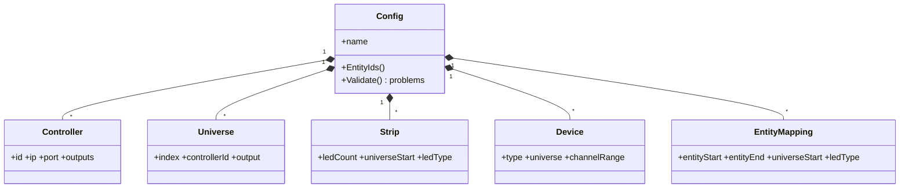
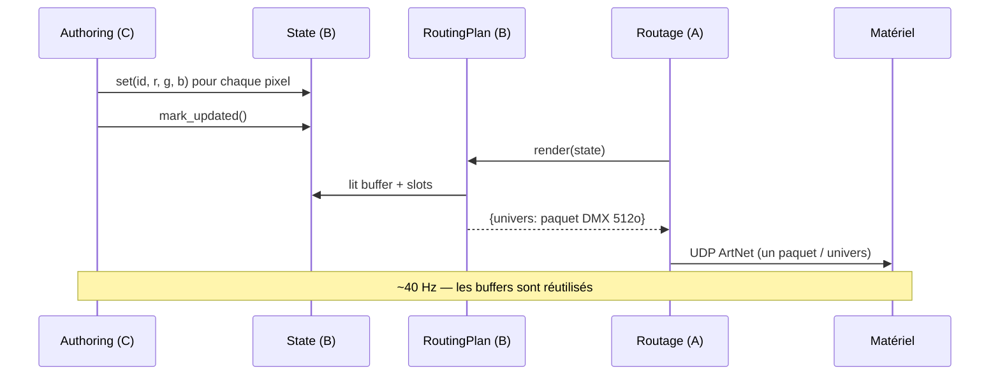
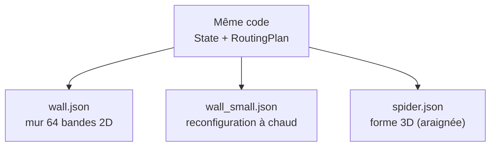
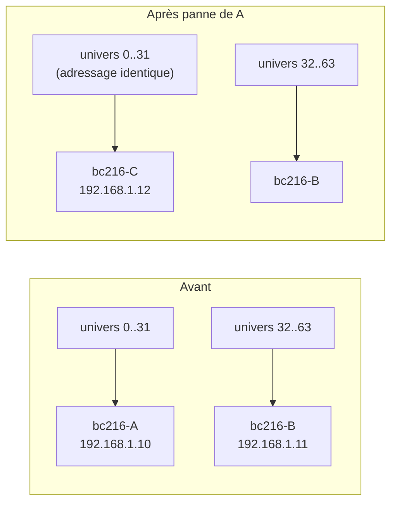
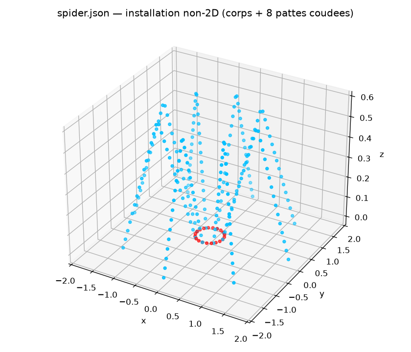

# Architecture — support de soutenance (P4)

> Rôle Personne B : garant du **découplage**. Ce document présente la structure
> du code et l'architecture générale (critère P4 : « explication satisfaisante
> de l'architecture »). Les diagrammes ci-dessous sont en Mermaid (rendus par
> GitHub / l'aperçu Markdown de VS Code) avec une version ASCII de secours.

## 1. Vue d'ensemble : 3 blocs découplés


L'installation est pilotée par une chaîne en 3 étages. Le **seul** point de
contact entre eux est constitué de **deux contrats** que je fournis : le
`State` (données par frame) et la `Config` / `RoutingPlan` (mapping matériel).



Version ASCII :

```
  Authoring (C)                Personne B                 Routage (A)
 ┌──────────────┐        ┌───────────────────┐        ┌──────────────┐
 │ crée des     │  écrit │      State        │  lit   │ encode ArtNet│
 │ animations   ├───────▶│ (buffer RVBW)     │◀───────┤ + envoie UDP │──▶ Matériel
 └──────────────┘        │                   │        └──────────────┘   (BC216,
                         │  Config /         │  entité → univers/canal    LED, lyres)
                         │  RoutingPlan      ├───────────────▲
                         └───────────────────┘
```

**Message clé pour l'oral :** C ne connaît **que** des IDs de pixels à colorer.
A ne connaît **que** le `State` + le `RoutingPlan`. Aucun des deux ne connaît
l'autre. On peut donc remplacer/tester chaque bloc indépendamment.

## 2. Les deux contrats

### 2.1 Le `State` — contrat de données (par frame)



- Écrit par C, lu par A.
- Entité non renseignée = **noir** `(0,0,0,0)`.
- Choix perf : **buffer dense** indexé par slot, réutilisé d'une frame à
  l'autre (voir §4).

### 2.2 La `Config` — contrat matériel (statique, rechargeable)



`RoutingPlan(config)` précalcule, pour chaque entité, son adresse physique
`(univers, canal)` — avec débordement d'univers automatique — et fournit à A
des paquets DMX de 512 octets prêts à envoyer.

## 3. Flux à l'exécution (une frame)



## 4. Décisions d'architecture (et pourquoi)

| Décision                                                          | Raison                                                                         |
| ----------------------------------------------------------------- | ------------------------------------------------------------------------------ |
| **Buffer dense** RVBW réutilisé (pas de dict/frame)               | ~16 000 entités × 40 Hz : éviter allocations et pression GC                    |
| Adressage par **plages** (`EntityMapping`) au lieu d'1 entrée/LED | Config compacte et lisible pour 8 000+ entités                                 |
| Résolution **précalculée** dans `RoutingPlan`                     | A ne recalcule rien par frame : juste une copie d'octets                       |
| Positions 3D **hors** du contrat de routage (fichier séparé)      | A n'en a pas besoin ; supporte des formes quelconques sans alourdir le routage |
| Config en **JSON**                                                | Lisible, versionnable Git, éditable à la main, livrable exigé                  |
| **`Validate()`** avant chargement                                 | Attrape tôt : contrôleur inconnu, débordement, chevauchement d'IDs             |
| Implémentation **C# / `netstandard2.1`**                          | Compatible Unity, langage retenu par l'équipe                                  |

## 5. Flexibilité démontrée (les 3 scénarios P4)



- **Reconfiguration en direct** : `ConfigManager.reload(...)` bascule d'une
  config à l'autre et notifie A (démo P4).
- **Panne d'un contrôleur** : `Failover.ReplaceController(...)` redéploie les
  univers d'un contrôleur défaillant vers un remplaçant.
- **Géométrie non-2D** : `spider.json` prouve que le mur 2D n'est qu'un cas
  particulier ; les contrats ne changent pas.

### Zoom : panne de contrôleur (`dotnet run --project Mappa.Cli -- failover`)

Point d'architecture fort pour l'oral : **la panne ne touche pas l'adressage
logique**. Les LED physiques ne bougent pas → `entity_map` (donc le
`RoutingPlan` : entité → univers/canal) est **inchangé**. Seule l'association
_univers → contrôleur/IP_ est réécrite.



C'est exactement le scénario demandé par la doc (« un contrôleur tombe en panne
→ j'en ajoute un et je redirige ») et ça se démontre en direct sans recompiler.



_(Corps en rouge dans le plan z=0, 8 pattes coudées montant en z : une
installation non planaire routée par exactement le même code que le mur.)_

## 6. Performance (le juge de P2)

`Mappa.Bench` mesure `render()` sur le mur cible (16 384 entités, 128 univers) :

| Métrique                   | Valeur mesurée            |
| -------------------------- | ------------------------- |
| `render()` moyen           | **~0,19 ms / frame**      |
| Budget d'une frame à 40 Hz | 25 ms                     |
| Budget utilisé             | **~0,7 %** (marge ≈ ×130) |

La synchro son/lumière est le critère de perf visible : ce résultat montre que
le pipeline (buffer dense + plan précalculé) laisse tout le budget au reste
(authoring, audio, réseau). Reproductible : `dotnet run -c Release --project Mappa.Bench`.

## 7. Où est quoi dans le code

| Bloc                          | Fichier                                          |
| ----------------------------- | ------------------------------------------------ |
| Contrat State                 | `csharp/Mappa/State.cs`                          |
| Config + validation           | `csharp/Mappa/Config.cs`                         |
| Résolution routage (pour A)   | `csharp/Mappa/RoutingPlan.cs`                    |
| Save/Load + hot reload        | `csharp/Mappa/Persistence.cs`                    |
| Mur LED                       | `csharp/Mappa/Wall.cs`                           |
| Formes non-2D                 | `csharp/Mappa/Shapes.cs`                         |
| Failover / redéploiement      | `csharp/Mappa/Failover.cs`                       |
| Émetteur ArtNet (réf. côté A) | `csharp/Mappa/ArtNet.cs`                         |
| CLI / Bench / Tests           | `csharp/Mappa.Cli`, `Mappa.Bench`, `Mappa.Tests` |

## 8. Trois phrases à retenir pour l'oral

1. « Toute la communication passe par **deux contrats** : le `State` (par frame)
   et la `Config`/`RoutingPlan` (matériel). »
2. « Grâce à ce découplage, création, routage et matériel évoluent **en
   parallèle et se testent isolément**. »
3. « Le mur 2D, la reconfiguration à chaud et l'araignée 3D utilisent
   **exactement le même code** — seule la config change. »
